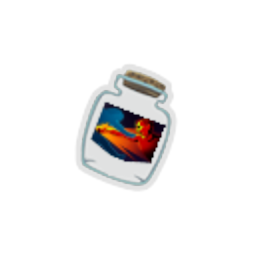
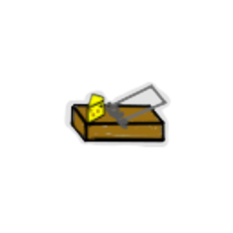
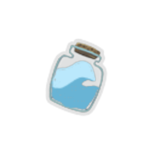
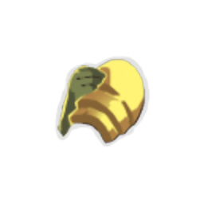
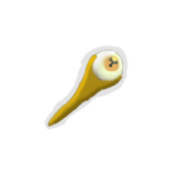
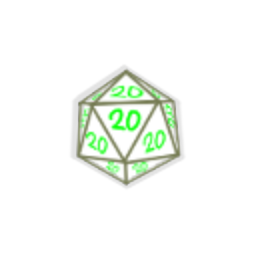
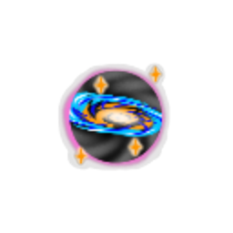

## Relics

| Image | Name | Rarity | Color | Description | Flavor |
| ----- | ---- | ------ | ----- | ----------- | ------ |
|  | Bottled Anger | Common | Red | At the start of each combat, draw all Angers from your deck. Can overfill your hand. Upon pickup, add an Anger to your deck. | Not actually a bottle relic. |
|  | Compendium | Common |  | At the start of each combat, add a random Rare card to your draw pile. It costs 1 less. | How to win the game in 3 easy steps. |
|  | Cultist Figurine | Common |  | Gain 1 #yStrength every #b3 turns. | Collect them all! |
|  | Focusing Lens | Common | Blue | Whenever you attack an enemy, all #yLightning orbs will target that enemy for the rest of the turn. | Feel the power! |
|  | Mousetrap | Common |  | The first time you get attacked each combat, deal 15 damage to the attacker. | Watch your fingers. |
|  | Pendant | Common |  | Upon pickup, choose an adjective. Adjectives give bonuses at the start of each combat. | It attunes to the user's will. |
|  | Pet Rock | Common |  | At the start of each turn, deal #b5 damage to the enemy with the least HP. | Remember to feed your pet rock once every 6 hours. |
|  | Sapping Stone | Common |  | At the start of each combat, ALL enemies lose #b1 #yStrength until the end of their turn. | Saps away the strength of others. |
|  | Tough Gloves | Common |  | Take no thorns damage from enemies. | Guaranteed to protect you from thorns, or your money back. |
|  | Weightless Weaponry | Common | Green | Your #yShivs now #yRetain. | Have you ever seen an anti-gravity knife? |
|  | Writer's Block | Common |  | At the end of your turn, if you have not played a skill this turn, gain #b6 Block. | Brick. |
|  | Bottled Shadow | Uncommon |  | Upon pickup, choose a card. When you play that card, it is played an additional time. | How do you bottle a lack of photons in the visible light spectrum? |
|  | Bottled Tsunami | Uncommon |  | Upon pickup, choose a card. When you draw that card, add #b2 copies with #yEthereal and #yExhaust to your hand. | Open for infinite water. |
|  | Byrd Charm | Uncommon |  | At the start of combat, gain 1 #yFlight. | Lets you float. A little. |
|  | Disaster in a Bottle | Uncommon |  | Upon pickup, choose a card. When you play that card, deal #b10 damage to ALL enemies. | Bottled Disasters are almost cute. |
|  | Guardian Spirit | Uncommon |  | Upon pickup, fill your potion slots with Fairy in a Bottle. | Hey! Listen! |
|  | Icicle Precepts | Uncommon | Blue | Whenever you #yChannel a #yFrost orb, gain 1 #yThorns. Whenever you #yEvoke or remove a #yFrost orb, lose 1 #yThorns. | Rule #142: Icicles can be used as a stabbing weapon for self defence. |
|  | Rapid Fire | Uncommon |  | Whenever you deal attack damage, increase it by 2. | Fire that moves veryily fastily. |
|  | Stainless Steel | Uncommon | Red | Every time you gain #yBlock #b3 times in a single turn, gain #b5 #yBlock. | Stainless makes pain-less. |
|  | Wind-Up Auto-Dealer | Uncommon |  | Right Click to gain a charge. At the start of each turn, if this relic has charges, lose a charge and draw a card. | Batteries not included. |
|  | Wondrous Wand | Uncommon |  | Draw an extra card at the start of combat. It costs #b0 this turn. | Free Magic. |
|  | Ancestral Armaments | Rare | Green | #yShivs are now upgraded when created. #yShivs can be upgraded any number of times. | The armaments are actually made of knives. |
|  | Berserker's Draught | Rare | Red | Whenever you play an attack, add a charge to this relic. Whenever you play a skill, remove all charges. At the start of each combat, gain 1 #yStrength for each charge on this relic. | ROOOOAAAAAARRRGH |
|  | Chaining Vapors | Rare | Green | If you've already drawn #b4 cards this turn (Excluding your initial hand), whenever you draw a card, apply #b1 #yPoison to a random enemy. | How a chain of poison gas is made is a mystery. |
|  | Hand of Midas | Rare |  | Whenever you attack a non-elite non-boss enemy, there is a #b5% chance that you gain #yGold equal to their HP and instantly kill them. | Hasn't lost its magic touch. |
|  | Miracle Grow | Rare | Blue | The passive of your #yDark Orbs trigger a number of times equal to what slot they're in. | Not approved by the FDA. |
|  | Snecko Scepter | Rare |  | Whenever you draw a card that costs #b3 or more, its cost is randomized. | Eyeball on a stick. |
|  | Zombie Heart | Rare |  | Whenever a non-minion enemy dies, gain #b1 Max HP, take #b1 damage. | Must... Feed... |
|  | Demon Heart | Boss | Red | At the start of your turn, if you have 3 or more attacks in hand, gain [E] [REMOVE_SPACE]. | Side effects include uncontrollable urges for world domination. |
|  | Neutrino Generator | Boss | Blue | Whenever you play a card, #yChannel an orb based on its cost. #b0 - Random Orb. #b1 - #yLightning Orb. #b2 - #yFrost Orb. #b3 - #yDark Orb. #bX - #yPlasma Orb. | Has a known side effect of being hard to pronounce. |
|  | Rigged Dice | Boss | Green | Whenever you discard a card, your next #yAttack this turn deals double damage. | Critical Success |
|  | Stolen Kidneys | Boss |  | Upon pickup, remove all Basic Strikes from your deck. At the start of each turn, draw a card until you draw a non-Basic card. | Wait. That's illegal. |
|  | Bi-phase Biplane | Shop |  | At the start of your turn, put a random non-Status non-Curse card from your #yExhaust pile to your hand. it gains #yPurge and #ytrackpad:Spectral [REMOVE_SPACE]. | *Loud whirring noises* |
|  | Pocket Galaxy | Shop |  | Any time a card enters your discard pile, shuffle a random card into your draw pile. It costs #b1 less. | A galaxy in the palm of your hand. |
|  | Void Sphere | Shop |  | At the start of combat, give all cards in your draw pile #yEthereal. | You lose grasp of reality. |

