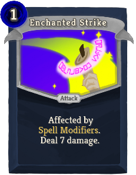
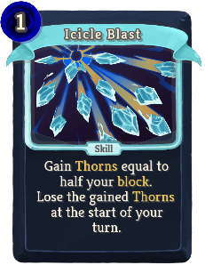
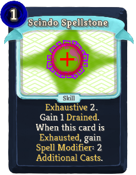
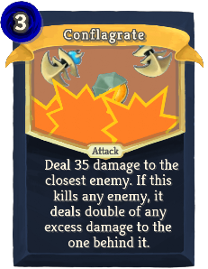

## Cards

| Name | Image | Upgraded image | Rarity | Type | Cost | Description |
| ---- | ----- | -------------- | ------ | ---- | ---- | ----------- |
| Defend |  |  | Basic | Skill | 1 | Gain 5(8) Block. |
| Detailed Annotation |  |  | Basic | Skill | 2 | scribe:Spell_Modifier: Gain !SPELLEFFECTIVENESS! % scribe:Spell_Effectiveness. |
| Icy Defend |  |  | Basic | Skill | 1 | scribe:Spell_Effect: Gain 5(8) Block. |
| Lightning Strike |  |  | Basic | Attack | 1 | scribe:Spell_Effect: Deal !BETTERSPELLATTACK! Damage. |
| Strike |  |  | Basic | Attack | 1 | Deal 6(9) damage. |
| Scribed Spell |  |  | Special | Skill | 0 | scribe:Cast, Purge, scribe:Spectral. |
| Amp Spellstone |  |  | Common | Skill | 1 | Exhaustive !stslib:ex!. When this card is Exhausted, gain scribe:Spell_Modifier: !SPELLEFFECTIVENESS! % scribe:Spell_Effectiveness. |
| Arcane Barrier |  |  | Common | Skill | 1 | scribe:Spell_Effect: Gain 14(19) Block. scribe:Spell_Modifier: [#fa0000]Lose[] 25% scribe:Spell_Effectiveness. |
| Blunt Weapons |  |  | Common | Skill | 1 | scribe:Spell_Effect: Apply 1(2) Weak. |
| Divination |  |  | Common | Skill | 0 | Look at the top 2(3) cards of your deck. Put 1 into your hand, Exhaust the other(s). |
| Enchanted Strike |  |  | Common | Attack | 1 | Affected by scribe:Spell_Modifiers. Deal 7(11) damage.  |
| Focusing Blow |  |  | Common | Attack | 1 | Deal 7(11) damage. Gain 1 scribe:Drained. scribe:Spell_Modifier: Gain !SPELLEFFECTIVENESS! % scribe:Spell_Effectiveness. |
| Freeze |  |  | Common | Skill | 1 | (Apply 1 Weak to ALL enemies.)  scribe:Spell_Effect: Gain !BETTERSPELLBLOCK! Block. |
| Frostvenom Toxin |  |  | Common | Skill | 1 | Gain 5(7) Block. scribe:Spell_Effect: Apply 3(4) Poison. |
| Gather Components |  |  | Common | Skill | 1 | Exhaust a random (not random)card in your hand. Gain scribe:Spell_Effect: Deal !BETTERSPELLATTACK! damage if it was an attack, otherwise, gain scribe:Spell_Effect: Gain !BETTERSPELLBLOCK! Block. |
| Incendio |  |  | Common | Attack | 2 | Costs 1 [E] if you are scribe:Drained. Deal 22(28) damage. Gain !BETTERDRAINED! scribe:Drained. |
| Invigorating Strike |  |  | Common | Attack | 1 | Deal 8(11) damage. If you are scribe:Drained, gain scribe:Spell_Effect: gain [E]. |
| Lightning Bolt |  |  | Common | Attack | 1 | Deal 6(9) damage to ALL enemies. scribe:Spell_Effect: Deal 5 damage. |
| Magic Missiles |  |  | Common | Attack | 1 | Deal 3(5) damage 2 times. Increase the number of hits for each unique scribe:Spell_Effect and scribe:Spell_Modifier. (Hits 2 Times.) |
| Mirror Image |  |  | Common | Skill | 1 | Gain 4(6) Block. scribe:Spell_Effect: Gain 4(6) Block. |
| Overcharge |  |  | Common | Attack | 1 | scribe:Spell_Effect: Deal 13(18) damage to an enemy, and !OverchargeVariable! to yourself. |
| Reckless Response |  |  | Common | Skill | 0 | Apply 2 Vulnerable to ALL enemies. scribe:Spell_Effect: Deal !BETTERSELFDAMAGE! damage to yourself. |
| Storm Savvy |  |  | Common | Attack | 1 | Draw a (1(2)) card(s). scribe:Spell_Effect: Deal !BETTERSPELLATTACK! damage. |
| Telum Spellstone |  |  | Common | Attack | 1 | Exhaustive !stslib:ex!. When this card is Exhausted, gain scribe:Spell_Effect: deal !BETTERSPELLATTACK! damage. |
| Thrown Scroll |  |  | Common | Attack | 0 | Deal 4 Damage. Remove ALL your scribe:Spell_Effects and scribe:Spell_Modifiers. Deals 1 additional damage for each 3(2) stacks removed. |
| Toxic Spellstone |  |  | Common | Skill | 1 | Exhaustive !stslib:ex!. When this card is Exhausted, gain scribe:Spell_Effect: Apply 11(14) Poison. |
| Arcane Arcing |  |  | Uncommon | Attack | X | Gain X times: scribe:Spell_Effect: Deal !BETTERSPELLATTACK! Damage. |
| Barrier Of Light |  |  | Uncommon | Skill | 4(3) | Costs 1 less [E] for each 25% of health missing. Gain 1 Block for each 3 Max HP. (Gain 0 Block.) |
| Blank Scroll |  |  | Uncommon | Power | 1 | (Innate.)  Your spell now starts with " scribe:Spell_Modifier: Gain !SPELLEFFECTIVENESS! % scribe:Spell_Effectiveness. " |
| Capacitance Scroll |  |  | Uncommon | Power | 1 | Your spell now starts with " scribe:Spell_Effect: Deal 3(6) damage." |
| Clarity |  |  | Uncommon | Skill | 2 | scribe:Spell_Effect: Gain 1(2) [E]. |
| Crippling Charge |  |  | Uncommon | Attack | 1 | scribe:Spell_Effect: Deal !BETTERSPELLATTACK! damage. scribe:Spell_Modifier: [#fa0000]Lose[] !SPELLEFFECTIVENESS! % scribe:Spell_Effectiveness. |
| Crystal Shield |  |  | Uncommon | Skill | X | Gain 7(9) Block and 2(3) Thorns X Times. Lose the gained Thorns at the start of your turn. |
| Eldritch |  |  | Uncommon | Skill | 2(1) | scribe:Spell_Effect: Apply 5 Poison and 2 Weak. |
| False Life |  |  | Uncommon | Skill | 1(0) | Block is gained as Temporary_HP this turn. Exhaust. |
| Flow Like Water |  |  | Uncommon | Power | 1 | When you play this, and at the start of your turn, if you are scribe:Drained, gain 3(5) Dexterity until end of turn. |
| Focused |  |  | Uncommon | Skill | 1 | Gain 5 Block. scribe:Spell_Modifier: Gain !SPELLEFFECTIVENESS! % scribe:Spell_Effectiveness. |
| Focusing Barrier |  |  | Uncommon | Skill | 2 | scribe:Spell_Effect: Gain 10(16) Block. scribe:Spell_Modifier: Gain !SPELLEFFECTIVENESS! % scribe:Spell_Effectiveness. |
| Frantic Search |  |  | Uncommon | Skill | 0 | Draw 15(10) cards. Any that don't fit in your hand are Exhausted. |
| Glacies Spellstone |  |  | Uncommon | Skill | 1 | Gain 10(13) Block. Exhaustive !stslib:ex! When this card is Exhausted, gain 10(13) Block. |
| Hemorrhage |  |  | Uncommon | Attack | 2 | Deal 10(15) damage. Stun target enemy for 1 turn. Gain 2 scribe:Drained. Exhaust. |
| Icicle Blast |  |  | Uncommon | Skill | 1 | Gain Thorns equal to half (not half)your block. Lose the gained Thorns at the start of your turn. |
| Insight |  |  | Uncommon | Skill | 0 | Draw 2 cards, Exhaust (not, Exhaust). |
| Lightning Blade |  |  | Uncommon | Attack | 1 | Deal 5 damage. Deals additional damage equal to amount of scribe:Thunder. (Draw a card.)  (Deal 5 damage.) |
| Liquidum Scroll |  |  | Uncommon | Power | 1 | (Innate.)  While scribe:Drained, draw an additional card at the start of your turn. |
| Meditate |  |  | Uncommon | Skill | 2 | Remove all Debuffs. Exhaust. (not Exhaust.) |
| Piercing Bolts |  |  | Uncommon | Attack | 1 | scribe:Spell_Effect: Deal 6 damage. scribe:Spell_Modifier: Your (your) scribe:Thunder deals double (2.5 times) damage when hitting an enemy with Block. Stacks diminishingly. (not.) |
| Price of Knowledge |  |  | Uncommon | Skill | 0 | This card costs 5(2) gold to play. Add a (an upgraded) "Price of Knowledge" to your hand. Purge. Draw 1 Card. |
| Quick Study |  |  | Uncommon | Skill | 1(0) | Add an scribe:Echo of a random card in your deck to your hand. It costs 0. Exhaust. |
| Ritual of Sacrifice |  |  | Uncommon | Attack | 1 | Deal 7(9) damage. If this kills an enemy, heal for 25% of the slain enemy's Max HP. Exhaust. |
| Sanguine Surge |  |  | Uncommon | Attack | 1 | Add a (an upgraded) "Sanguine Surge" to your hand. Purge. scribe:Spell_Effect: Deal 10(13) damage to an enemy and !BETTERSELFDAMAGE! to yourself. |
| Scindo Spellstone |  |  | Uncommon | Skill | 1 | Exhaustive !stslib:ex!. Gain !BETTERDRAINED! scribe:Drained. When this card is Exhausted, gain scribe:Spell_Modifier: !BETTERSPLIT! scribe:Additional_Casts. |
| Scroll Of Poison |  |  | Uncommon | Power | 2(1) | Whenever you take damage on your turn, apply that much Poison to ALL enemies. |
| Scroll of Scrying |  |  | Uncommon | Power | 1 | Gain !BETTERDRAINED! scribe:Drained. At the end of your turn, you may place a card from your hand on top of your draw pile. The first card you draw each turn costs 1 less. |
| Scroll of Shadows |  |  | Uncommon | Power | 3(2) | Whenever you play the first card each turn, if it is a power, add an scribe:Echo of it to your hand. It costs 1 less. |
| Split |  |  | Uncommon | Skill | 1 | scribe:Spell_Modifier: [#fa0000]Lose[] 50% scribe:Spell_Effectiveness, gain 1(2) scribe:Additional_Cast(s). |
| Static Cage |  |  | Uncommon | Attack | 2 | Gain 11(16) Block. scribe:Spell_Effect: Deal !BETTERSPELLATTACK! damage. |
| Static Series |  |  | Uncommon | Attack | 1 | scribe:Spell_Effect: Deal !BETTERSPELLATTACK! damage. scribe:Spell_Modifier: Your spells now target 1 additional enemy. Cannot target the same enemy more than once. |
| Weird Blast |  |  | Uncommon | Attack | 0 | (Draw a card.)  Gain !BETTERDRAINED! scribe:Drained. scribe:Spell_Effect: Deal !BETTERSPELLATTACK! damage. |
| Weird Shield |  |  | Uncommon | Skill | 0 | (Draw a card.)  Gain 8 Block. scribe:Spell_Effect: Deal !BETTERSELFDAMAGE! damage to yourself. |
| Weird Toxin |  |  | Uncommon | Skill | 0 | (Draw a card.)  Gain !SCRIBEM2! Weak and !SCRIBEM2! Frail. scribe:Spell_Effect: Apply 6 Poison. |
| Words of Power |  |  | Uncommon | Power | 1 | Whenever you (gain or) lose a buff, deal 3 damage to a random enemy. |
| Absolute Zero |  |  | Rare | Skill | 3 | Give ALL enemies 50(30) Block. After this turn, start another turn. Your Hand, Block and Energy are Retained. Exhaust. |
| Anomalous Texts |  |  | Rare | Skill | 1 | Lose all negative scribe:Spell_Effectiveness and all scribe:Additional_Casts. Gain 25% scribe:Spell_Effectiveness for each !SPELLEFFECTIVENESS!% lost, and !ANOMALOUSTEXTSVARIABLE!% scribe:Spell_Effectiveness for each scribe:Additional_Cast lost. Exhaust. |
| Blood Magicks |  |  | Rare | Power | 3(2) | Whenever you take damage on your turn, draw a card and gain 1 [E]. |
| Catalytic Catastrophe |  |  | Rare | Skill | 1 | Apply 3(5) Poison. Deal the sum of damage that half the Poison will deal. (Deal !SCRIBEM2! damage) |
| Conflagrate |  |  | Rare | Attack | 3 | Deal 35(50) damage to the closest enemy. If this kills any enemy, it deals double of any excess damage to the one behind it. |
| Deluge |  |  | Rare | Power | 2 | Whenever you play the first (two) card(s) each turn, if you are scribe:Drained, add an scribe:Echo of a random card from your deck that costs less than or equal energy to your hand. It costs 0. Gain 2 scribe:Drained. |
| Echo |  |  | Rare | Skill | 2 | Exhaust. scribe:Spell_Modifier: Gain 1(2) scribe:Additional_Cast(s). |
| Escalation |  |  | Rare | Power | 2 | (Innate.)  For the first scribe:Spell_Effect you play each turn, add an scribe:Echo of that scribe:Spell_Effect to your hand. It costs 0. Gain 1 scribe:Drained. |
| Focusing Bolt |  |  | Rare | Attack | 1 | scribe:Spell_Effect: Deal !BETTERSPELLATTACK! damage. scribe:Spell_Modifier: Gain !SPELLEFFECTIVENESS! % scribe:Spell_Effectiveness. |
| Forked Bolt |  |  | Rare | Skill | 1 | Add 2(3) scribe:Echoes of random cards that give scribe:Spell_Effect: damage from your deck into your hand. They cost 0 this turn. Exhaust. |
| Glacial Guard |  |  | Rare | Skill | 2 | Cannot be played if you have played an attack this turn. (not Cannot be played if you have played an attack this turn.) You cannot play additional attacks this turn. Gain 30 Block. |
| Inscribe Death |  |  | Rare | Attack | 2 | Deal 24(36) damage to ALL enemies. scribe:Spell_Effect: Deal 12 damage to yourself. |
| Overexert |  |  | Rare | Skill | 0 | Play a random (not random)card in your hand twice, then Exhaust it. Gain scribe:Drained equal to its cost. |
| Recurring Rime |  |  | Rare | Skill | 1 | scribe:Spell_Effect: Gain 6(9) Block. scribe:Spell_Modifier: Gain !BETTERSPLIT! scribe:Additional_Cast this turn. Exhaust. |
| Scripted Starfall |  |  | Rare | Power | 1 | Retain. Innate. At the end of your turn, deal !SCRIBEM2! damage to ALL enemies. Increase the damage by 2(3) for each turn this remains in your hand. |
| Scroll of Chaining |  |  | Rare | Power | 1 | At the start of your turn (and when you play this), gain 1 scribe:Spell_Modifier: Your spells now target 1 additional enemy. Cannot target the same enemy more than once. |
| Spectral Scroll |  |  | Rare | Power | 2 | You and ALL enemies gain 2(3) Intangible. |
| Stem the Flow |  |  | Rare | Power | 2 | (Innate.)  Whenever you gain a debuff, gain Temporary_HP equal to the amount. Stacks diminishingly. |
| Time Dilation |  |  | Rare | Skill | 1(0) | Gain !BETTERDRAINED! scribe:Drained. Exhaust. Apply Slow. |

## Potions

| Image | Name | Rarity | Description |
| ----- | ---- | ------ | ----------- |

## Relics

| Image | Name | Rarity | Color | Description | Flavor |
| ----- | ---- | ------ | ----- | ----------- | ------ |
|  | Spell Scribe's Scroll | Starter | Scribe_blue | At the start of each combat, choose 1 of 3 cards to shuffle into your draw pile. | Inscribed with an "S" it radiates arcane energies. |
|  | Storm Scale | Common | Scribe_blue | Whenever you would gain #yscribe:Spell_Effect [REMOVE_SPACE]: Damage, Increase it by #b1 for each card played this turn. | A tough and shiny scale. Its innate ability to conduct electricity makes it a great foci for lightning-based spells. |
|  | Osmotic Filter | Uncommon | Scribe_blue | Whenever you gain #yscribe:Drained [REMOVE_SPACE], gain that much [E] at the start of your next turn. | A mysterious device that is cool to touch and hums very slightly. It spouts crystal clear water that is refreshing to drink. |
|  | Permafrost Pen | Uncommon | Scribe_blue | Whenever you play a card that gives a #yscribe:Spell_Effect [REMOVE_SPACE], gain #b3 Block. | An ice cold writing instrument, adorned with a snowflake. Its chill numbs the nerves to pain. |
|  | Alchemical Alter | Rare | Scribe_blue | Whenever you would gain #yscribe:Spell_Effect [REMOVE_SPACE]: Damage, gain half of it as #ySpell #yEffect [REMOVE_SPACE]: #yPoison [REMOVE_SPACE]. | A flask of poison, supercharged with electricity. The potency of the toxin will shock you. |
|  | Runic Repeater | Rare | Scribe_blue | Gaining a #yscribe:Spell_Modifier causes a random card in your hand to cost 1 less until end of turn. | A small metallic loop, adorned with strange letters. Wearing it seems to deepen your capacity for magic. |
|  | Invisible Inkwell | Boss | Scribe_blue | Gain " [REMOVE_SPACE]#ySpell #yEffect [REMOVE_SPACE]: Gain 2 [E] [REMOVE_SPACE]" at the start of each turn. At the end of each turn, lose all #yscribe:Spell_Effects and #yscribe:Spell_Modifiers [REMOVE_SPACE]. | An ornate Inkwell that spills forth an endless torrent of nothing. You quickly lose track of spells scribed with this "ink". |
|  | Meditation Circle | Boss | Scribe_blue | At the start of your turn, gain 25% scribe:Spell_Effectiveness. Then, if you have less than or equal to 50% scribe:Spell_Effectiveness, gain an scribe:Additional_Cast this turn. | This makes you wonder: Is a circle technically a polygon of infinite sides? |

| Image | Name |
| ----- | ---- |
|  | The Spell Scribe |

