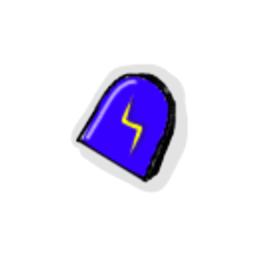

| Image | Name | Rarity | Color | Description | Flavor |
| ----- | ---- | ------ | ----- | ----------- | ------ |
|  | Spell Scribe's Scroll | Starter | Scribe_blue | At the start of each combat, choose 1 of 3 cards to shuffle into your draw pile. | Inscribed with an "S" it radiates arcane energies. |
|  | Storm Scale | Common | Scribe_blue | Whenever you would gain #yscribe:Spell_Effect [REMOVE_SPACE]: Damage, Increase it by #b1 for each card played this turn. | A tough and shiny scale. Its innate ability to conduct electricity makes it a great foci for lightning-based spells. |
|  | Osmotic Filter | Uncommon | Scribe_blue | Whenever you gain #yscribe:Drained [REMOVE_SPACE], gain that much [E] at the start of your next turn. | A mysterious device that is cool to touch and hums very slightly. It spouts crystal clear water that is refreshing to drink. |
|  | Permafrost Pen | Uncommon | Scribe_blue | Whenever you play a card that gives a #yscribe:Spell_Effect [REMOVE_SPACE], gain #b3 Block. | An ice cold writing instrument, adorned with a snowflake. Its chill numbs the nerves to pain. |
|  | Alchemical Alter | Rare | Scribe_blue | Whenever you would gain #yscribe:Spell_Effect [REMOVE_SPACE]: Damage, gain half of it as #ySpell #yEffect [REMOVE_SPACE]: #yPoison [REMOVE_SPACE]. | A flask of poison, supercharged with electricity. The potency of the toxin will shock you. |
|  | Runic Repeater | Rare | Scribe_blue | Gaining a #yscribe:Spell_Modifier causes a random card in your hand to cost 1 less until end of turn. | A small metallic loop, adorned with strange letters. Wearing it seems to deepen your capacity for magic. |
|  | Invisible Inkwell | Boss | Scribe_blue | Gain " [REMOVE_SPACE]#ySpell #yEffect [REMOVE_SPACE]: Gain 2 [E] [REMOVE_SPACE]" at the start of each turn. At the end of each turn, lose all #yscribe:Spell_Effects and #yscribe:Spell_Modifiers [REMOVE_SPACE]. | An ornate Inkwell that spills forth an endless torrent of nothing. You quickly lose track of spells scribed with this "ink". |
|  | Meditation Circle | Boss | Scribe_blue | At the start of your turn, gain 25% scribe:Spell_Effectiveness. Then, if you have less than or equal to 50% scribe:Spell_Effectiveness, gain an scribe:Additional_Cast this turn. | This makes you wonder: Is a circle technically a polygon of infinite sides? |
